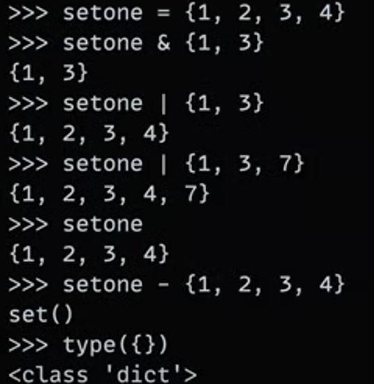

# data types / Objects type

## Type

### Core
```py

- number : 123, 3.1415, 3+4j, Decimal(3.1415), Fraction(3, 4)
- string : 'hello', "Bob's", b'a\x01c', u'sp\xc4m'
- boolean : True, False
- list : [1, 2, 3, ['a', 'b', 'c']], list(1, 2, 3)
- tuple : (1, 2, 3), ('a', 'b', 'c'), tuple(1, 2, 3)
- dictionary : {'name' : 'Bob', 'age' : 32}, dict(name='Bob', age=32)
- set : {1, 2, 3}, {'a', 'b', 'c'}, set(1, 2, 3)

- file : open('hello.txt', 'w')

- None : None
```
### Advanced types
```py
- decorator
- generator
- itterator
- meta programming
```

## Numbers

```python
int : 123, -5945
float : 3.1415, 1.98e5
complex : 3+4j
# type conversion
binary : 0b1010 = 10 (1*2 + 0*2 + 1*2 + 0*2)
bin(10), int('1010', 2)

octal : 0o17 = 15 (1*8 + 7*8)
oct(15), int('17', 8)

hex : 0xa2 = 162 (10*16 + 2*16)
hex(162), int('a2', 16)
```

### Blunder in numbers 


#### Python
```py
decimal('0.1') : 0.1
Fraction(3, 4) : 3/4
```

## Set
`set : {1, 2, 3}, {'a', 'b', 'c'}, set(1, 2, 3)`

- **|** : or operator
- **&** : and operator
- empty set : **set()**



## Bool
```py
>>> True + 4
5
```


## String

```py
chai = "Masala chai"
firt_char = chai[0]
# firt_char = 'M'
sliced_chai = chai[0:6]
# sliced_chai = 'Masala'
last_char = chai[-1]
# last_char = 'i'
```

### slicing
> **[ start : End : stepover ]**
- start included but not end
- stepover is default 1

```py
num = "0123456789"

print(num[:])
# 0123456789
print(num[2:])
# 23456789
print(num[:8])
# 01234567

print(num[2:8])
# 234567
print(num[2:8:2])
# 246
print(num[2:8:3])
# 25

print(num[8:2:-1])
# 876543
print(num[::-1])
# 9876543210
print(num[-2:-8:-2])
# 864
```

### Methods
```py
space_chai = '    masala    chai    '
print(space_chai.strip())
# masala    chai


chai = 'MasAla Chai'

# lenth
print(len(chai))
# 10


print(chai.upper())
# MASALA CHAI
print(chai.lower())
# masala chai
print(chai.title())
# Masala Chai
print(chai.capitalize())
# Masala chai
print(chai.swapcase())
# mASALA cHAI


# count - no. of appearence case sensitive
print(chai.count('a'))
# 2

# first appearence index
print(chai.find('a'))
# 5

# find from 3 to 11 default is 0 to len(chai)
print(chai.find('a', 3, 11))
# 5

# replaceing in string   MasAla <-> ginger
print(chai.replace('MasAla', 'Ginger'))
# Ginger Chai
```

### format & Raw string
```py
name = 'Bob'
age = 32
sentace = 'My name is {} and I am {} years old'
print(sentace.format(name, age))
# My name is Bob and I am 32 years old

raw = r"c:\user\pwd\my\n"
print(raw)
# c:\user\pwd\my\n
# No Errors
```

### split & join

```py
s = 'Masala, Ginger, Lemon, Ice'
print(s.split(', '))
# ['Masala', 'Ginger', 'Lemon', 'Ice']

print(' '.join(['Masala', 'Ginger', 'Lemon', 'Ice']))
# Masala Ginger Lemon Ice
```

## List

```py
# Initialization
>>> tea_variaties = ['Black', 'White', 'Oolong', 'Green']

# printing
>>> print(tea_variaties)
['Black', 'White', 'Oolong', 'Green']


>>> print(tea_variaties[2])
Oolong
```
### slicing

```py
>>> print(tea_variaties[1:3])
['White', 'Oolong']
>>> print(tea_variaties[-2])
Oolong
```
### string is $Mutable$
```py
>>> tea_variaties[3] = 'Harbal'
>>> print(tea_variaties)
['Black', 'White', 'Oolong', 'Harbal']
```

### list assigning and replacing with sliced  
```py
>>> tea_variaties[1:2]         
['White']
>>> tea_variaties[1:2] = 'Lemon'

# BLUNDER 
>>> tea_variaties               
['Black', 'L', 'e', 'm', 'o', 'n', 'Oolong', 'Harbal']


>>> tea_variaties = ['Black', 'White', 'Oolong', 'Green']

# use another technique
>>> tea_variaties[1:2] = ['Lemon'] 
>>> tea_variaties
['Black', 'Lemon', 'Oolong', 'Green']

>>> tea_variaties[1:3]           
['Lemon', 'Oolong']
>>> tea_variaties[1:3] = ['Masala', 'Ice'] 
>>> tea_variaties
['Black', 'Masala', 'Ice', 'Green']

# assignment at mid of list
>>> tea_variaties[1:1]
[]
>>> tea_variaties[1:1] = ['test1', 'test2'] 
>>> tea_variaties
['Black', 'test1', 'test2', 'Masala', 'Ice', 'Green']

# delete at mid of list
>>> tea_variaties[1:3]
['test1', 'test2']
>>> tea_variaties[1:3] = []
>>> tea_variaties
['Black', 'Masala', 'Ice', 'Green']
```

### Use for loop & if statement

```py
>>> tea_variaties = ['Black', 'Masala', 'Ice', 'Green']
>>> for tea in tea_variaties:
...     print(tea)
... 
Black
Masala
Ice
Green

>>> if 'Oolong' in tea_variaties:
...     print('We have Oolong Tea')
# Oops we don't have Oolong Tea 😅

>>> tea_variaties.append('Oolong')
>>> if 'Oolong' in tea_variaties:
...     print('We have Oolong Tea')
We have Oolong Tea
>>> tea_variaties
['Black', 'Masala', 'Ice', 'Green', 'Oolong']
```

### Methods

```py
# append / add
>>> tea_variaties.append('lemon')
>>> print(tea_variaties)
['Black', 'Masala', 'Ice', 'Green', 'Oolong', 'lemon']

# pop / remove last
>>> tea_variaties.pop()
'Lemon'
>>> print(tea_variaties)
['Black', 'Masala', 'Green', 'Oolong']

# insert
>>> tea_variaties.insert(1, 'Lemon')
>>> print(tea_variaties)
['Black', 'Lemon', 'Masala', 'Green', 'Oolong']

# remove
>>> tea_variaties.remove('Lemon')
>>> print(tea_variaties)
['Black', 'Masala', 'Green', 'Oolong']

# sort
>>> tea_variaties.sort()
>>> print(tea_variaties)
['Black', 'Green', 'Masala', 'Oolong']

# reverse
>>> tea_variaties.reverse()
>>> print(tea_variaties)
['Oolong', 'Masala', 'Green', 'Black']

# count
>>> print(tea_variaties.count('Oolong'))
1

# index
>>> print(tea_variaties.index('Oolong'))
3

# copy
>>> tea_variaties2 = tea_variaties
>>> print(tea_variaties2)
['Oolong', 'Masala', 'Green', 'Black']

# clear
>>> tea_variaties.clear()
>>> print(tea_variaties)
[]
```
### list comprehension / oprations into list

```py
>>> squares_num = [x**2 for x in range(10)]
>>> print(squares_num)
[0, 1, 4, 9, 16, 25, 36, 49, 64, 81]
```

## Dictionary

```py
# initialize
>>> chai_types = {'Masala' : 'Spicy', 'Ginger': 'Zesty', 'Green': 'Mild'}
>>> chai_types
{'Masala': 'Spicy', 'Ginger': 'Zesty', 'Green': 'Mild'}

>>> chai_types['Masala']
Spicy

# Get
>>> chai_types.get('Masala')
Spicy

# update
>>> chai_types['Green'] = 'Fresh'
>>> chai_types
{'Masala': 'Spicy', 'Ginger': 'Zesty', 'Green': 'Fresh'}
```

### Use for loop & if statement

#### loop

```py
>>> for chai in chai_types:
...     print(chai)

Masala
Ginger
green

>>> for chai in chai_types:
...     print(chai, chai_types[chai])

Masala Spicy
Ginger Zesty
Green Fresh
```

#### Special

```py
>>> for key, value in chai_types.items():
...     print(key, value)
 
Masala Spicy
Ginger Zesty
Green Fresh

>>> chai_types.items()
dict_items([('Masala', 'Spicy'), ('Ginger', 'Zesty'), ('Green', 'Fresh')])
```

#### if

```py
>>> if 'Green' in chai_types:
...     print('We have Green Chai')
We have Green Chai
```

### Methods

```py
#len
>>> print(len(chai_types))
3

# Add item
>>> chai_types['earl Grey'] = 'Citrus'
>>> chai_types
{'Masala': 'spicy', 'Ginger': 'Zesty', 'earl Grey': 'Citrus'}

# pop
>>> chai_types.pop('Ginger')
'Zesty'
>>> chai_types
{'Masala': 'spicy', 'earl Grey': 'Citrus'}

# PopItems
>>> chai_types.popitem()
'earl Grey': 'Citrus'
>>> chai_types
{'Masala': 'spicy'}

#del
>>> del chai_types['Masala'] 
>>> chai_types
{}

# copy
>>> chai_types = {'Masala' : 'Spicy', 'Ginger': 'Zesty', 'Green': 'Mild'}
>>> chai_type_copy = chai_type.copy() # make diffrent copy

# 
>>> del chai_types['Masala'] 
>>> chai_types
{}
```

### Nested Dictonary

```py
# Initialise
>>> tea_shop = {
... "chai": {"Masala": "Spicy", "Ginger": "Zesty"},
... "Tea": {"Green": "Mild", "Black": "Strong"}
... }
>>> tea_shop
{'chai': {'Masala': 'Spicy', 'Ginger': 'Zesty'}, 'Tea': {'Green': 'Mild', 'Black': 'Strong'}}

>>> print(tea_shop) 
{'chai': {'Masala': 'Spicy', 'Ginger': 'Zesty'}, 'Tea': {'Green': 'Mild', 'Black': 'Strong'}}

# 1st indexed
>>> tea_shop["chai"] 
{'Masala': 'Spicy', 'Ginger': 'Zesty'}

# Nested indexed
>>> tea_shop["chai"]["Ginger"] 
'Zesty'
```

### Dictionary comprehension / oprations into dict

```py
>>> squares_num = {x:x**2 for x in range(6)}
>>> print(squares_num)
{0: 0, 1: 1, 2: 4, 3: 9, 4: 16, 5: 25}
```

### Construct dict
```py
>>> keys = ["Masala", "Ginger", "Lemon"]
>>> Default_val = "Delicious"

>>> new_dict = dict.fromkeys(keys, Default_val)

>>> new_dict
{'Masala': 'Delicious', 'Ginger': 'Delicious', 'Lemon': 'Delicious'}
```

what if 
```py
>>> keys = ["Masala", "Ginger", "Lemon"]
>>> # Default_val = "Delicious"

>>> new_dict = dict.fromkeys(keys, Keys)

>>> new_dict
{'Masala': ["Masala", "Ginger", "Lemon"],
 'Ginger': ["Masala", "Ginger", "Lemon"],
 'Lemon': ["Masala", "Ginger", "Lemon"]
}
```

## Tuple

> They are just like list But Immutble 🔍
```py
>>> tea_tuple = ("Black", "Green", "oolong")

>>> tea_tuple[0]
"Black"

>>> tea_tuple[0] = "Mix"
Traceback (most recent call last):
  File "<stdin>", line 1, in <module>
TypeError: 'tuple' object does not support item assignment


```