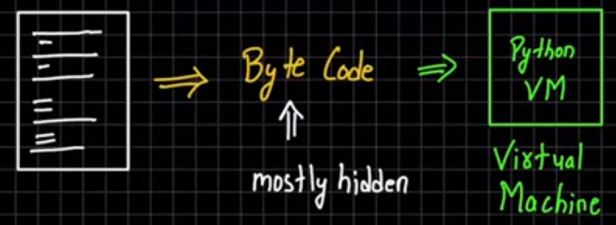
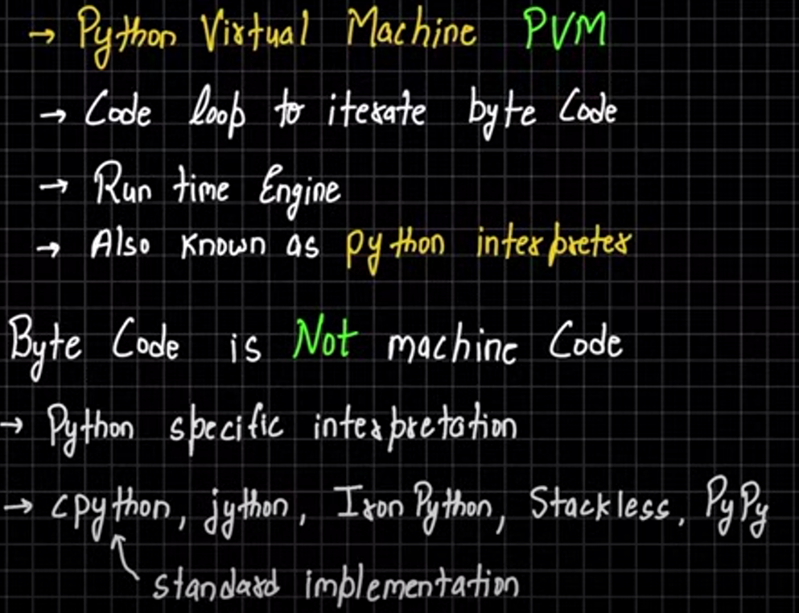
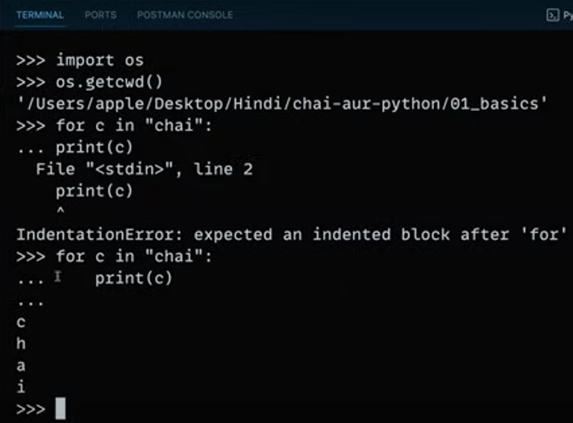
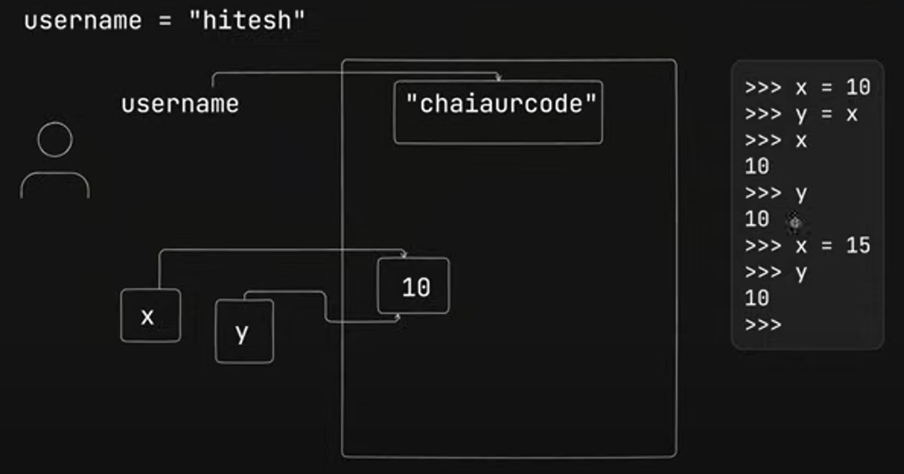
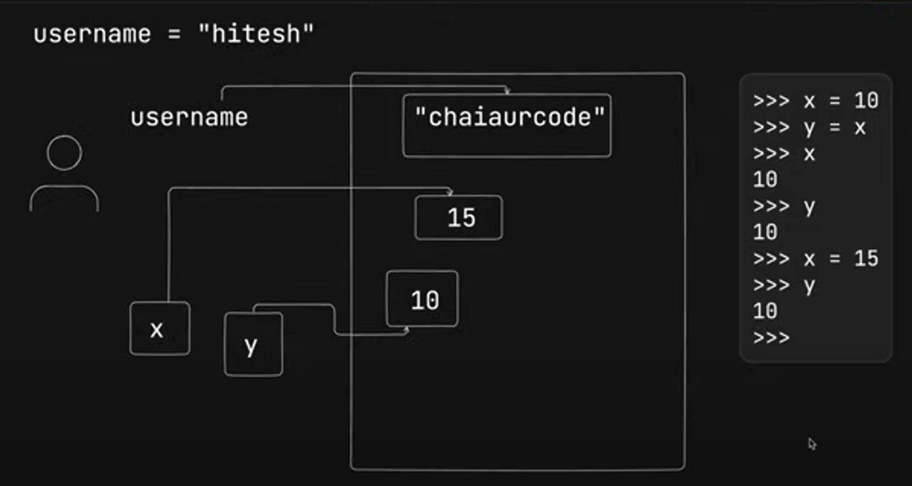

# Inner Working
> **py file --> Bytecode --> PVM**



### compile to bitecode 
    
        low level & platform Independent
        bytecode run faster
>  `.pyc` compiled python (Frozen Binaries)


## File
| -> \_\_pychache__  -->  ` hello.cpython-321.pyc`

- work with imported file onlly


# PVM ( Python Vertual Machine )


# PYTHON SHELL

### BASH
```bash
$ python
Python 3.12.2 (tags/v3.12.2:6abddd9, Feb  6 2024, 21:26:36) [MSC v.1937 64 bit (AMD64)] on win32
Type "help", "copyright", "credits" or "license" for more information.
>>> print("chai aur python")
chai aur python 
```


# MUTABLE V/S IMMUTABLE

> Immutable : when value changed in the memory data is changed  
> Mutable : when value changed the new memory allocated to the new location


        
        then     ⬇️⬇️⬇️⬇️⬇️⬇️



# 'is' v/s '=='

- **'=='** : this is compare values in varibles

- **'is'** : this is compare memory address of variables

### Python Code
```python
>>> p1[0] = 1 
>>> p1 == p2  
    True
>>> p1 is p2
    False
```